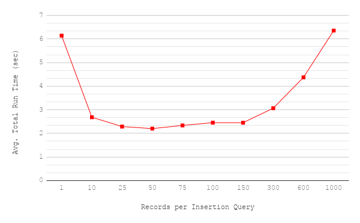

JR. CODING CHALLENGE FOR MS3
By Kaan Ibici

To build and run the application: 

`mvn clean package && java -jar target/coding-challenge-0.0.1-SNAPSHOT.jar`

Or, if the application has already been built, just:

`java -jar target/coding-challenge-0.0.1-SNAPSHOT.jar`

The application will prompt the user to enter a path to a csv file in the 
command line. If the path points to a valid csv file, the file contents are 
parsed and correct records are inserted into a database in the data/databases 
directory within the project repository. Performance logs and invalid records 
are written to the data/logs directory. 

Save locations can be modified by changing the path constants in the 
DbGenerator class. The program can also be set to run once  without prompt 
using the sample csv by changing the SINGLE_RUN flag in the 
CodingChallengeApplication class.

Implementation notes: 

* DbGenerator class creates an object for each csv given to the application. 
This is meant to allow private helper functions to access variables associated 
with the insertion process/log data. 

* csv contents are inserted into a table named 'contents'. If a database with 
the same name as the one provided already exists in the set database directory, 
the application connects to that database and overwrites its contents table, if
one exists.

* There is a paramater constant REC_PER_QUERY (RPQ) in the DbGenerator class 
that sets the number of records grouped into each query. The purpose of this
was to avoid the inefficiency introduced by inserting one record at a time, 
while preventing the application from loading too much data into its variables 
and overworking the database by inserting too much data in a single query. I 
tested a range of RPQ values between 1 and 1000 and found that performance 
improves up until about 50 records per query, after which performance begins 
to decline. A graph of the test results is shown below.

